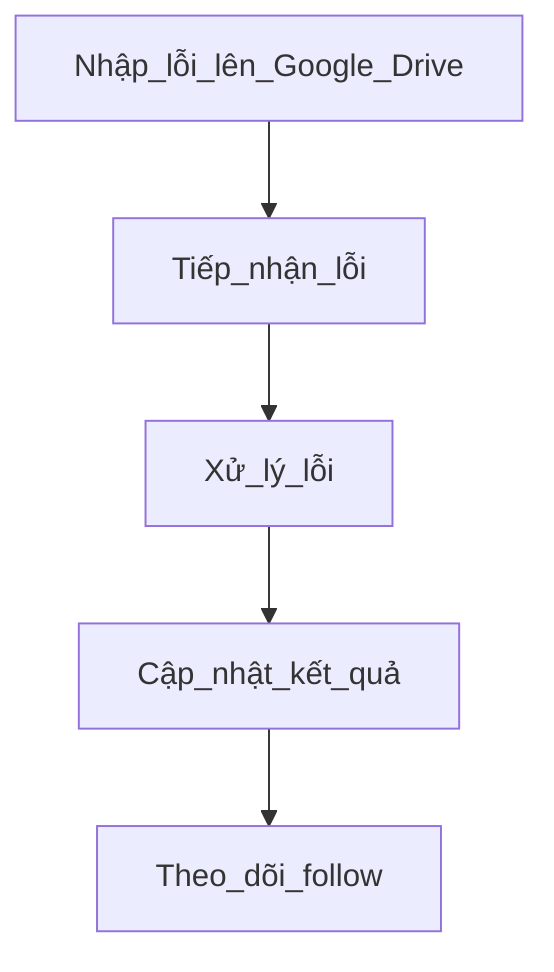
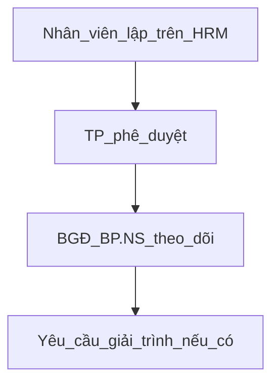

# Biên bản họp giao ban - Trung tâm sản xuất FoxAI
**Tuần 2 từ 10-16/02/2025**

## 1.Doanh thu dự án
|Tên dự án|Doanh số|Doanh thu đã xuất hóa đơn|Doanh thu chưa xuất hóa đơn|Doanh thu dự kiến tháng|
|---|---|---|---|---|
|Bảo Tín Minh Châu - BTMC|---|---|---|---|
|Phúc Long - PL|---|---|---|---|
|Dược khoa - DK|---|---|---|---|
|APSP|---|---|---|---|
|NEO|---|---|---|---|
|APFCO|---|---|---|---|
|Thuốc lá Thăng Long - TLTL Power BI|---|---|---|Về sau sẽ lấy tự động trên SAP|
|Techcom - TCI|---|---|---|---|
|Xuân Thiện - XT|---|---|---|Tạm hoãn|

## 2.Tiến độ dự án
**2.1.Bảo Tín Minh Châu**
- Hiện tại: Hết giai đoạn 3.
- Giai đoạn 4: Bắt đầu từ 17/02/2025
- Các vướng mắc: Sẽ họp chi tiết với phòng triển khai sau.
- Công việc: Giao cho team DA thiết kế Power BI trong giai đoạn bảo trì để upsale (Mr.Tụ làm đầu mối, giao cho Mr.Tiến phụ trách kéo dữ liệu từ SQL).
  - Chiều phân tích (bộ lọc): Cửa hàng, Sản phẩm, Khách hàng
  - Bán hàng: Tiền, vàng, số lượng, khối lượng
  - Mua hàng: Tiền, vàng, số lượng, khối lượng
  - Tồn kho: Tiền, vàng, số lượng, khối lượng

**2.2.Phúc Long**
- Hiện tại: Hết giai đoạn 3. Trong giai đoạn 3 sẽ sang làm việc chi tiết với khách hàng
- Giai đoạn 4: Bắt đầu từ 23/04/2025
- Các vướng mắc: Nhân sự làm Portal và sẽ họp chi tiết sau.

**2.3.Thuốc lá Thăng Long**
- Giai đoạn hiện tại: TLTL đang ở giai đoạn 3 (nghiệm thu theo giai đoạn)
- Kế hoạch tiếp theo: Giai đoạn 4 bắt đầu đào tạo
  * Từ 11-13.02.2025: đào tạo cho bộ phận nhập liệu (Mr.Tiến chuẩn hóa file Excel form nhập liệu).
  * Từ 18-20.02.2025: đào tạo cho BGĐ và bộ phận quản lý.
- Mục tiêu: Hoàn thành đào tạo vào cuối tháng để thu nốt 25% tiền.
- Công việc:
  - Định - Phòng triển khai sẽ chuẩn hóa biên bản nghiệm thu của FoxAI gửi lên Sharepoint công ty (Mr.Long gửi link).
  - Tiến - team DA nghiên cứu giải pháp tạo giao diện nhập liệu cho các bộ phận TLTL lên SQL BI để upsale trong giai đoạn bảo trì.

**2.4.Dược khoa**
- Hiện tại: Giai đoạn 5. Chờ khách hàng gửi lại số liệu để Golive 1 tháng.
- Các vướng mắc: Khách hàng chưa gửi số liệu, chậm tiến độ => Mr.Toàn sẽ push từ trên xuống.

**2.5.Techcom - TCI**
- Team AI nghiên cứu phát triển giải pháp MRP - Dự báo tồn kho nguyên vật liệu. Đầu mối làm việc với Mr.Toàn.

**2.6.Dự án nội bộ**
- Team AI nghiên cứu phát triển giải pháp Chatbot AI cho SAP nội bộ, dự kiến: 28/02/2025 ra mắt.
- Team DA triển khai giải pháp Power BI cho FoxAI nội bộ, thời hạn: 18/02/2025.
  - Chuẩn hóa báo cáo: Mr.Toàn + Mrs.Hiền kế toán
  - Mr.Tiến sẽ kéo dữ liệu từ SQL của SAP nội bộ.
  - Ưu tiên làm Báo cáo tổng hợp doanh thu, doanh số theo sản phẩm, dịch vụ
- Kế hoạch doanh thu của sản phẩm khối AI nằm trong khối khác là: 5 tỷ VNĐ/năm.
- Giao cho team AI (Mr.Sơn) sử dụng N8N để gửi email thông báo tới NV bảo trì khi KH thêm dòng trên file Google Drive bảo trì.

## 3.Phổ biến quy trình, quy định công ty
**3.1.Quy trình quản lý lỗi bảo trì**

Bước 1.KH nhập lỗi trên link Google Drive

Bước 2.NV bảo trì tiếp nhận lỗi

-Qua kênh Zalo, Email

-Hàng ngày review lỗi

Bước 3.Xử lý lỗi

-Giao tiếp qua nhóm Zalo chung

-Gọi điện, ultraview

-Liên hệ với kỹ thuật code, triển khai liên quan.

Bước 4.Điền kết quả lên link

- Kết quả hỗ trợ

- Phân loại lỗi thành các nhóm chuẩn như sau:
  - 1.Lỗi SAP quy chuẩn (Quantity, Xuất kho âm...)
  - 2.Lỗi FoxAI chặn theo yêu cầu người theo
  - 3.Lỗi thao tác người dùng
  - 4.Lỗi code kỹ thuật
  - 5.Lỗi phần mềm của bên thứ 3 (Data transfer Workbend, Power BI...)
- Cách giải quyết

Bước 5.Follow, nếu lỗi bị Reopen.

Hàng ngày, nhân viên bảo trì cập nhật trên link Google Drive (tiếp nhận lỗi qua nhóm chung, xử lý và phân loại lỗi theo 5 nhóm trên), trưởng phòng có trách nhiệm kiểm tra lại.

=> Công việc cần thực hiện:
  - Mr.Toàn chuẩn hóa biên bản các giai đoạn
  - Mr.Toàn chuẩn hóa tài liệu các dự án trên Sharepoint
  - Mr.Toàn chuẩn hóa Database chuẩn, VAS chuẩn

**3.2.Quy trình xin nghỉ phép**

Bước 1.Nhân viên lập đơn nghỉ phép trên hrm.fox.ai.com.vn

=> Mr.Toàn đề xuất phân quyền duyệt nghỉ phép trên HRM cho các trưởng phòng.

-Đối với các đơn nghỉ trong tháng 2.2025 đã duyệt ngoài thì nhân viên làm bổ sung trên HRM để bộ phận nhân sự có thông tin chấm công.

Bước 2.Trưởng phòng phê duyệt đơn nghỉ phép

-Đối với nhân viên đang trong dự án thì vẫn xin phép trưởng phòng của mình và báo cáo lại cho PM (Project Manager) dự án.

Bước 3.Bộ phận nhân sự tổng hợp chấm công

Bước 4.Bộ phận nhân sự yêu cầu giải trình qua email với các trường hợp chưa rõ thông tin

## 4.Công tác nhân sự
- Luân chuyển Mr.Lê Hải Sơn sang phòng Phân tích dữ liệu (DA)
- Tuyển dụng:
  - Thực tập sinh: không giới hạn số lượng
  - DA Power BI: 2 junior
  - Triển khai: 4 junior trở lên
  - Bảo trì - kỹ thuật SAP: 2 junior trở lên
- Đào tạo:
  - Mr.Toàn lên kế hoạch đào tạo SQL, Python...
  - Mr.Long lên kế hoạch đào tạo Kế toán, Data Science, Data Analyst...
  - Thời gian dự kiến: sáng thứ 7 hàng tuần (ngoài giờ để không ảnh hưởng đến chất lượng các dự án)
- Đánh giá:
  - Review KPIs: Mr.Toàn sẽ gửi lại danh sách để các trưởng phòng review, ngồi riêng với từng nhân viên
  - Tăng lương: Mr.Toàn sẽ gửi và ngồi riêng với từng trưởng phòng.

## 5.Công việc khác

- Phòng triển khai đề xuất mua máy tính cho các nhân viên đã đủ điều kiện vào chính thức (Máy MSI cấu hình chưa ổn => Đề xuất máy khác như Dell, Hp...)
- Phòng DA đề xuất tài khoản Chat GPT dùng chung bản Plus (Tài khoản 5 account, mua 2 tài khoản)
- Phòng DA đề xuất Server có thêm cạc đồ họa NVDIA RTX 4070, 16Gb VRAM trở lên để chạy các mô hình AI.
- Hàng tuần, các trưởng phòng theo dõi kế hoạch và kết quả công việc tuần trên GitHub theo nguyên tắc:
  - Dự án bên ngoài thì công việc gắn người.
  - Dự án R&D thì người gắn với việc.
 
