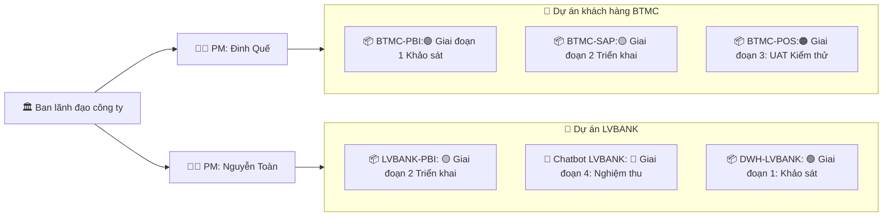
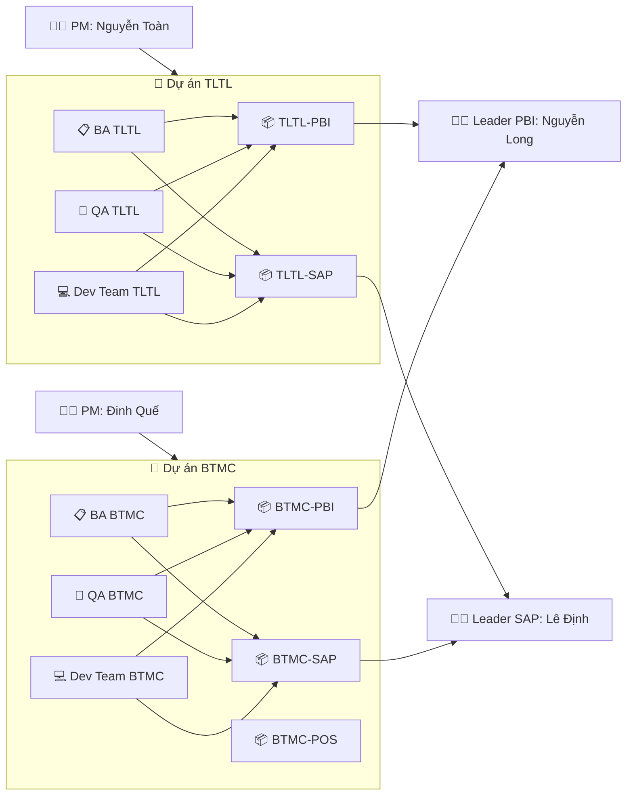
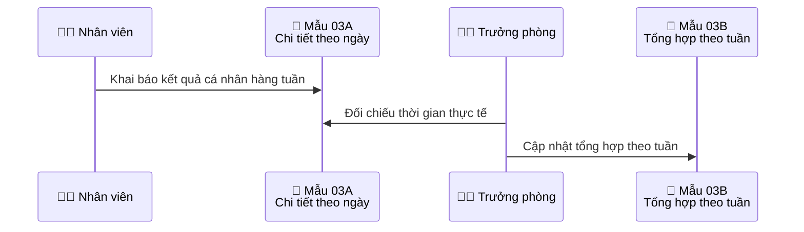
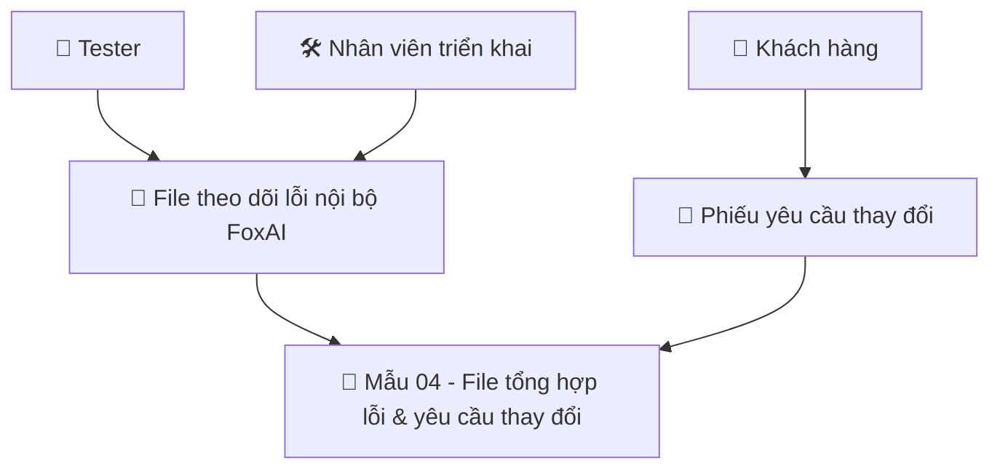

# Biên bản họp giao ban - Trung tâm sản xuất FoxAI
**Tuần 16 - Tuần 3 tháng 4 - Từ ngày 14/04-19/04**

## 1.Doanh thu dự án
|Tên dự án|Doanh số|Doanh thu đã xuất hóa đơn|Doanh thu chưa xuất hóa đơn|Doanh thu dự kiến tháng|
|---|---|---|---|---|

## 2.Tiến độ dự án
**2.1.TLTL-PBI**
- Hiện tại: 
- Kế hoạch tuần này: Bắt đầu chuyển sang giai đoạn 4 - Bảo trì từ ngày 07/04/2025.
- Các vướng mắc: ...
- Công việc cần thực hiện: ...
- Link cập nhật yêu cầu bảo trì [tại đây - Mẫu 04](https://foxai.sharepoint.com/:x:/s/TaiLieuTTSXFoxAI/EYzusCP-bCJCiWoL4td7-b0BiimN5uCz-QB1VyxA1ny1ww?e=pfhURE)

**2.2.BTMC-PBI**
- Hiện tại: Đã thiết kế xong hệ thống báo cáo, đã so sánh số liệu Mua hàng, Bán hàng & Kho với POS (đến ngày 31/03/2025).
- Kế hoạch tuần này: Chuẩn bị đào tạo khách hàng.
- Công việc cần thực hiện: ...
- Link cập nhật công việc dự án [tại đây - Mẫu 02](https://foxai.sharepoint.com/:x:/s/TaiLieuTTSXFoxAI/EdGUkESgaDVCkQFkZ3m3wnUB1Yw6Rsk82gyNjOlYNVotOw?e=6hBfmI)

## 3.Phổ biến quy trình, quy định công ty

Ngày 14/04/2025, toàn công ty thống nhất luồng cập nhật 4 mẫu báo cáo cụ thể như sau:

**3.1.Luồng khai báo mẫu biểu 01 - Kế hoạch tổng thể dự án**

- **Mục đích:** Báo cáo tiến độ từng dự án cho ban lãnh đạo công ty.
- **Người chịu trách nhiệm khai báo:** PM dự án.
- **Thư mục quản lý:**
  - Báo cáo gốc theo từng sản phẩm của từng dự án khách hàng, mỗi SP là 1 sheet, [ví dụ](https://foxai.sharepoint.com/:x:/s/TaiLieuTTSXFoxAI/Edd9jKWKinpPtAaDHYm2vF8BrIsdKqYHDxyPnXtEvn9WFg?e=lGNxbn)
  - File tổng hợp theo leader, PM tại [link](https://foxai.sharepoint.com/:f:/s/TaiLieuTTSXFoxAI/EsCdHatkZXRMqusbhk-c5RQBYgXP77xblXnB-19LI4_J9g?e=Pt9Fcx)
  - File tổng hợp biểu mẫu 01 - Toàn công ty tại [link](https://foxai.sharepoint.com/:x:/s/TaiLieuTTSXFoxAI/ETIBybqoo7pPpO6-XSaXe0EBrPzY4kUBb5FvCeJQBBnBAQ?e=r1EbaE)

**3.2.Luồng khai báo mẫu biểu 02 - Theo dõi chi tiết công việc hàng tuần**

- **Mục đích:** Giúp PM dự án quản lý chi tiết deadline và chất lượng các công việc (theo kế hoạch + phát sinh ngoài).

- **Người chịu trách nhiệm khai báo:**
  - PM dự án: đối với các công việc theo kế hoạch ở 3.1.
  - Nhân viên: đối với các công việc phát sinh ngoài kế hoạch.

- **Thư mục quản lý:**
  - Báo cáo gốc do leader và nhân viên khai báo cho từng sản phẩm của KH, [ví dụ](https://foxai.sharepoint.com/:x:/s/TaiLieuTTSXFoxAI/EdGUkESgaDVCkQFkZ3m3wnUB1Yw6Rsk82gyNjOlYNVotOw?e=6hBfmI)
  - Báo cáo tổng hợp theo KH sẽ được Sharepoint tự động cập nhật vào từng sheet, mỗi sheet là 1 sản phẩm tại [link]
  - `02. Quản lý dự án chung - Bảng theo dõi kế hoạch công việc hàng tuần FOXAI Nội bộ` tại [link](https://foxai.sharepoint.com/:x:/s/TaiLieuTTSXFoxAI/Ef_XOax4kflCloZweGue-mYBskdr4NxPitdgWnB8tC6VOA?e=WzuQHS)

**3.3.Quy định khai báo mẫu biểu 03 - Thời gian tham gia dự án**

- **Mục đích:** Giúp công ty phân bổ được số ngày công thực hiện theo từng dự án để tính toán chi phí thực tế.

- **Người chịu trách nhiệm khai báo:**
  - Nhân viên: Tự khai báo kết quả của cá nhân hàng ngày/tuần lên `Mẫu 03A - Thời gian tham gia dự án của nhân viên theo phòng ban` (có thể khai báo chi tiết theo ngày).
  - Trưởng phòng: Tổng hợp, đối chiếu với kết quả thời gian làm việc thực tế của từng nhân viên, cập nhật lên `Mẫu 03B - Thời gian tham gia dự án của toàn công ty` (tổng hợp theo tuần).
 
- **Thư mục quản lý:**
  - File gốc nằm trong thư mục riêng của từng phòng ban, mỗi tuần là 1 sheet, [ví dụ](https://foxai.sharepoint.com/:x:/s/TaiLieuTTSXFoxAI/Edd9jKWKinpPtAaDHYm2vF8BrIsdKqYHDxyPnXtEvn9WFg?e=lGNxbn)
  - File tổng hợp toàn công ty tại [đây](https://foxai.sharepoint.com/:x:/s/TaiLieuTTSXFoxAI/ESbc7o7tpXNMilSeUmVewlsBF2nUZOE4gio5b-X2lDkUZw?e=3lEVrf)

**3.4.Quy định khai báo mẫu biểu 04 - Theo dõi lỗi & yêu cầu thay đổi hệ thống**

- **Mục đích:** Giúp toàn bộ thành viên trong dự án theo dõi được các lỗi và yêu cầu thay đổi hệ thống của khách hàng, tránh các lỗi lặp lại và miss thông tin.

- **Người chịu trách nhiệm khai báo:**
  - Trong giai đoạn triển khai: Nhân viên khai báo khi phát hiện lỗi hoặc KH yêu cầu.
  - Trong giai đoạn bảo trì: Khách hàng cập nhật phiếu yêu cầu, FoxAI phê duyệt thì mới được sửa trên phần mềm.

## 4.Công tác nhân sự
- Luân chuyển/Thay đổi: Anh Trương Minh Thắng - bộ phận bảo trì nghỉ việc từ ngày 12/04/2025.
- Tuyển dụng:
  - Thực tập sinh: ...
  - DA Power BI: ...
  - Triển khai: ...
  - Bảo trì - kỹ thuật SAP: ...
- Đào tạo: 
    - Tuần này trung tâm sản xuất tiếp tục đào tạo nội bộ từ 18h ngày thứ 6 (18/04/2025). Đề cử Đinh Thị Quế làm lớp trưởng tạm quyền chịu trách nhiệm thông báo cho toàn bộ học viên ở trung tâm (Ít nhất sớm trước 02 ngày so với ngày đào tạo để mọi người sắp xếp lịch cán nhân).

- Đánh giá:

## 5.Công việc khác

- Bộ phận bảo trì: Dự kiến sẽ chuyển Thắng (thực tập) và Hiếu (thực tập) sang, Mr.Toàn sẽ phụ trách cả bộ phận.
