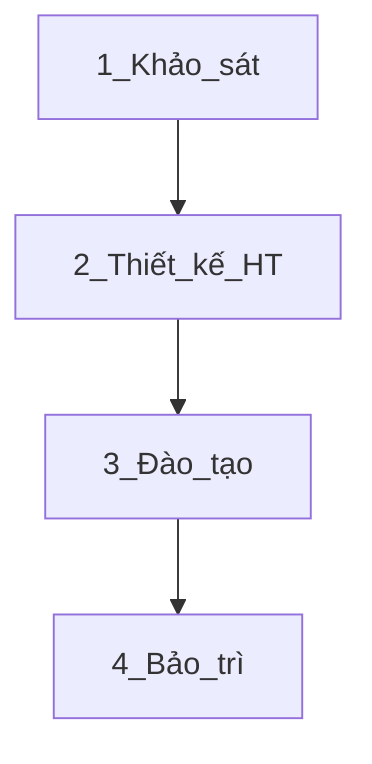
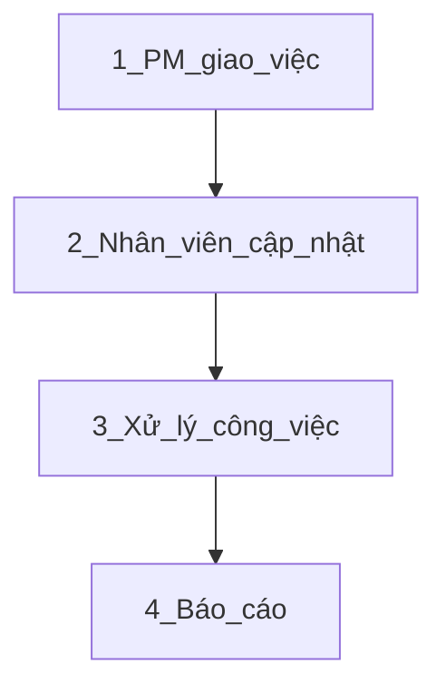
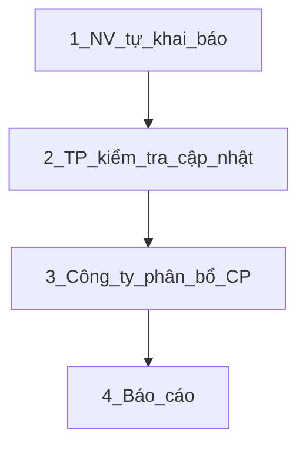
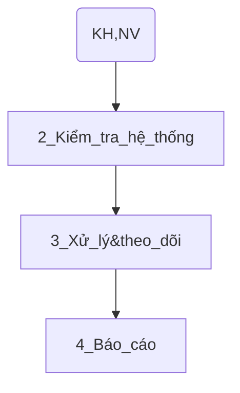

# Biên bản họp giao ban - Trung tâm sản xuất FoxAI
**Tuần 15 - Tuần 2 tháng 4 - Từ ngày 07/04-12/04**

## 1.Doanh thu dự án
|Tên dự án|Doanh số|Doanh thu đã xuất hóa đơn|Doanh thu chưa xuất hóa đơn|Doanh thu dự kiến tháng|
|---|---|---|---|---|

## 2.Tiến độ dự án
**2.1.TLTL-PBI**
- Hiện tại: Đã ký nghiệm thu giai đoạn 3 vào ngày 05/04/2025 => Đã gửi Mrs.Hiền kế toán để làm đề nghị thanh toán.
- Kế hoạch tuần này: Bắt đầu chuyển sang giai đoạn 4 - Bảo trì từ ngày 07/04/2025.
- Các vướng mắc: ...
- Công việc cần thực hiện: ...
- Link cập nhật yêu cầu bảo trì [tại đây - Mẫu 04](https://foxai.sharepoint.com/:x:/s/TaiLieuTTSXFoxAI/EYzusCP-bCJCiWoL4td7-b0BiimN5uCz-QB1VyxA1ny1ww?e=pfhURE)

**2.2.BTMC-PBI**
- Hiện tại: Đã thiết kế xong hệ thống báo cáo, đã so sánh số liệu Mua hàng, Bán hàng & Kho với POS (đến ngày 31/03/2025).
- Kế hoạch tuần này: Chuẩn bị đào tạo khách hàng.
- Công việc cần thực hiện: ...
- Link cập nhật công việc dự án [tại đây - Mẫu 02](https://foxai.sharepoint.com/:x:/s/TaiLieuTTSXFoxAI/EdGUkESgaDVCkQFkZ3m3wnUB1Yw6Rsk82gyNjOlYNVotOw?e=6hBfmI)

## 3.Phổ biến quy trình, quy định công ty

Ngày 08/04/2025, công ty ban hành 04 mẫu quy định cụ thể như sau:

**3.1.Quy định khai báo mẫu biểu 01 - Kế hoạch tổng thể dự án**

- **Mục đích:** Báo cáo tiến độ từng dự án cho ban lãnh đạo công ty.
- **Người chịu trách nhiệm khai báo:** PM dự án.
- **Thư mục quản lý:** Nằm trong thư mục từng dự án của khách hàng trên Sharepoint, [ví dụ](https://foxai.sharepoint.com/:x:/s/TaiLieuTTSXFoxAI/Edd9jKWKinpPtAaDHYm2vF8BrIsdKqYHDxyPnXtEvn9WFg?e=lGNxbn)

**3.2.Quy định khai báo mẫu biểu 02 - Theo dõi chi tiết công việc hàng tuần**

- **Mục đích:** Giúp PM dự án quản lý chi tiết deadline và chất lượng các công việc (theo kế hoạch + phát sinh ngoài).

- **Người chịu trách nhiệm khai báo:**
  - PM dự án: đối với các công việc theo kế hoạch ở 3.1.
  - Nhân viên: đối với các công việc phát sinh ngoài kế hoạch.

- **Thư mục quản lý:** Nằm trong thư mục từng dự án của khách hàng, mỗi sheet là 1 sản phẩm, [ví dụ](https://foxai.sharepoint.com/:x:/s/TaiLieuTTSXFoxAI/EdGUkESgaDVCkQFkZ3m3wnUB1Yw6Rsk82gyNjOlYNVotOw?e=6hBfmI)

**3.3.Quy định khai báo mẫu biểu 03 - Thời gian tham gia dự án**

- **Mục đích:** Giúp công ty phân bổ được số ngày công thực hiện theo từng dự án để tính toán chi phí thực tế.

- **Người chịu trách nhiệm khai báo:**
  - Nhân viên: Tự khai báo kết quả của cá nhân.
  - Trưởng phòng: Tổng hợp, đối chiếu với kết quả thời gian làm việc thực tế của từng nhân viên, cập nhật lên hệ thống của toàn công ty.
 
- **Thư mục quản lý:** Nằm trong thư mục riêng của từng phòng ban, [ví dụ](https://foxai.sharepoint.com/:x:/s/TaiLieuTTSXFoxAI/Edd9jKWKinpPtAaDHYm2vF8BrIsdKqYHDxyPnXtEvn9WFg?e=lGNxbn)

**3.4.Quy định khai báo mẫu biểu 04 - Theo dõi lỗi & yêu cầu thay đổi hệ thống**

- **Mục đích:** Giúp toàn bộ thành viên trong dự án theo dõi được các lỗi và yêu cầu thay đổi hệ thống của khách hàng, tránh các lỗi lặp lại và miss thông tin.

- **Người chịu trách nhiệm khai báo:**
  - Trong giai đoạn triển khai: Nhân viên khai báo khi phát hiện lỗi hoặc KH yêu cầu.
  - Trong giai đoạn bảo trì: Khách hàng cập nhật phiếu yêu cầu, FoxAI phê duyệt thì mới được sửa trên phần mềm.

## 4.Công tác nhân sự
- Luân chuyển:
- Tuyển dụng:
  - Thực tập sinh: Phòng DA tuyển thêm 2 thành viên là Sơn ở team PBI và Phúc ở team AI.
  - DA Power BI: ...
  - Triển khai: ...
  - Bảo trì - kỹ thuật SAP: ...
- Đào tạo: 
    - Tuần này trung tâm sản xuất tiếp tục đào tạo nội bộ từ 18h ngày thứ 6 (11/04/2025).
    - Kết quả đánh giá 3 đợt:
      - Đợt 1 có 22/22 tham gia và hoàn thành bài kiểm tra.
      - Đợt 2 có 20/22 hoàn thành, 2 người chưa hoàn thành là Nguyễn Xuân Tiến và Trần Quang Tùng.
      - Đợt 3 có 22/22 tham gia và hoàn thành bài kiểm tra.

- Đánh giá:

## 5.Công việc khác

- Ai? Làm công việc gì? Thời hạn?...
