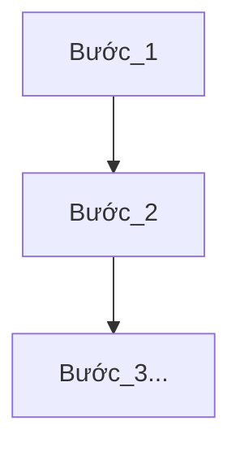

Template
# Biên bản họp giao ban - Trung tâm sản xuất FoxAI
**Tuần ... từ ngày ...-.../.../...**

## 1.Doanh thu dự án
|Tên dự án|Doanh số|Doanh thu đã xuất hóa đơn|Doanh thu chưa xuất hóa đơn|Doanh thu dự kiến tháng|
|---|---|---|---|---|

## 2.Tiến độ dự án
**2.1.Tên dự án 1**
- Hiện tại: Đang ở giai đoạn nào? 
- Kế hoạch tiếp theo: Bắt đầu từ ngày nào?
- Các vướng mắc: ...
- Công việc cần thực hiện: ...

## 3.Phổ biến quy trình, quy định công ty
**3.1.Quy trình số 1**

Bước 1:...

Bước 2:...

Bước 3:...

## 4.Công tác nhân sự
- Luân chuyển:
- Tuyển dụng:
  - Thực tập sinh: ...
  - DA Power BI: ...
  - Triển khai: ...
  - Bảo trì - kỹ thuật SAP: ...
- Đào tạo:

- Đánh giá:

## 5.Công việc khác

- Ai? Làm công việc gì? Thời hạn?...
