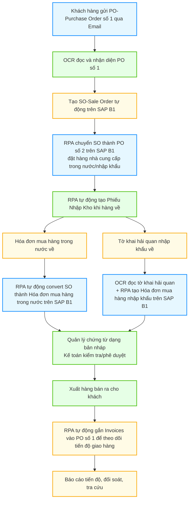

# FoxAI Native – Đột Phá Tự Động Hóa Quy Trình Bán & Mua Hàng Trên SAP B1 Cho Techcom
## Techcom “lột xác” vận hành nhờ giải pháp AI, OCR và RPA từ FoxAI Native

Techcom là một trong những doanh nghiệp hàng đầu tại Việt Nam trong lĩnh vực phân phối và cung cấp các thiết bị công nghiệp, linh kiện điện tử và vật tư kỹ thuật. Với mạng lưới khách hàng đa dạng, phục vụ hơn **hàng trăm khách hàng** trên toàn thế giới, Techcom xử lý trung bình **hàng trăm đơn hàng mỗi tháng**, đóng vai trò quan trọng trong chuỗi cung ứng của nhiều ngành sản xuất và công nghiệp. Khối lượng giao dịch lớn khiến các bước nhập liệu thủ công vừa chậm, vừa dễ sai sót, làm tăng gánh nặng cho bộ phận kế toán và vận hành.

**FoxAI Native** chính là lời giải toàn diện, mang lại trải nghiệm vận hành “không giấy tờ, không thủ công” cho Techcom – từ lúc tiếp nhận đơn đặt hàng (PO) của khách đến lúc hoàn tất xuất bán và theo dõi công nợ tự động trên SAP B1.

---
## Thách thức từ quy trình nhập liệu thủ công
Trước đây, quy trình xử lý đơn hàng và hóa đơn đầu vào tại Techcom chủ yếu dựa vào nhập liệu thủ công. Các nhân viên kế toán phải:

- Mở từng file PDF đơn hàng hoặc bảng kê hóa đơn đầu vào gửi qua email.  
- Đọc và ghi chép lại thông tin chi tiết từng đơn hàng: mã hàng, số lượng, giá trị, nhà cung cấp…  
- Nhập dữ liệu thủ công vào hệ thống SAP Business One (SAP B1).  
- Kiểm tra, rà soát và đối chiếu dữ liệu để tránh sai sót trước khi ghi sổ kế toán.  

Quy trình này không chỉ tiêu tốn nhiều thời gian công sức, mà còn dễ phát sinh sai sót do thao tác thủ công và áp lực khối lượng công việc lớn.

---
## Giải pháp Quy trình tự động hóa toàn diện với FoxAI Native

### 1. Nhận PO (Purchase Order) từ khách hàng – Tạo SO (Sale Order) trên SAP B1 hoàn toàn tự động

- Khách hàng gửi PO số 1 qua email cho Techcom.

- Hệ thống FoxAI Native sử dụng OCR tự động đọc dữ liệu trên PO (PDF, ảnh scan...), nhận diện chính xác mọi thông tin: mã hàng, số lượng, giá, điều khoản...

- AI chuyển toàn bộ dữ liệu này thành SO (Sale Order) trên SAP Business One chỉ trong vài giây, hoàn toàn không cần nhập tay.

### 2. Tự động hóa đặt hàng với nhà cung cấp (PO số 2)

- RPA (Robotic Process Automation) của FoxAI Native tiếp nhận SO vừa tạo, tự động chuyển đổi thành PO số 2 trên SAP B1 để đặt hàng với nhà cung cấp của Techcom (cả đơn nội địa lẫn nhập khẩu).

- Việc chuyển đổi này giúp loại bỏ mọi thao tác copy/paste, giảm triệt để nguy cơ nhầm lẫn mã hàng hoặc thông tin giá.

### 3. Nhập hàng về kho – Không cần nhập liệu thủ công

- Khi hàng về, RPA tiếp tục tự động chuyển PO số 2 thành phiếu nhập kho trên SAP.

- Tất cả chứng từ, số lượng, thông tin lô nhập, mã hàng… đều đồng bộ tức thì vào hệ thống, đảm bảo kiểm soát tồn kho chính xác.

### 4. Nhập hóa đơn đầu vào – Tự động cho cả hóa đơn nội địa và nhập khẩu

- Khi hóa đơn mua hàng nội địa về, RPA sẽ tự động convert SO thành hóa đơn mua hàng trên SAP B1 – giúp kế toán không cần nhập lại bất kỳ dòng dữ liệu nào.

- Với hóa đơn nhập khẩu, khi tờ khai hải quan về, OCR sẽ tự động đọc tờ khai, đính kèm chứng từ, đối chiếu với PO và nhập liệu lên SAP B1 thành hóa đơn mua hàng nhập khẩu.

- Tất cả đều diễn ra không giấy tờ, không phải thao tác thủ công.

### 5. Tự động cập nhật tiến độ giao hàng – Gắn Invoices vào PO khách

- Khi xuất bán, hệ thống RPA sẽ tự động gắn các Invoices (hóa đơn bán ra) vào PO số 1 của từng khách hàng.

- Bộ phận kinh doanh và dịch vụ khách hàng có thể theo dõi tiến độ giao hàng, đối soát công nợ, tra cứu lịch sử đơn hàng cực nhanh và minh bạch.

---
## Lợi ích vượt trội mà Techcom nhận được

- Tiết kiệm trên 33% thời gian thao tác thủ công: Giảm mạnh các bước nhập liệu, đối chiếu lặp lại.
- Đảm bảo dữ liệu nhất quán, xuyên suốt toàn bộ quy trình mua – bán – xuất – nhập kho.
- Tối ưu nguồn lực kế toán và vận hành, giải phóng nhân sự khỏi các công việc nhàm chán để tập trung vào phân tích, tối ưu chi phí, phát triển kinh doanh.
- Nâng cao trải nghiệm khách hàng, giúp Techcom phục vụ nhanh, chính xác, minh bạch hơn bao giờ hết.

Kết quả này giúp các bộ phận của Techcom có thêm thời gian tập trung vào các công việc giá trị cao hơn như phân tích tài chính, tối ưu quy trình và hỗ trợ ra quyết định quản trị.

Ông/Bà [Tên đại diện Techcom], đại diện công ty chia sẻ:  
> _"Ứng dụng FoxAI Native đã thực sự thay đổi cách chúng tôi vận hành, nâng cao hiệu suất làm việc và giảm thiểu sai sót. Đây là minh chứng cho sức mạnh của AI trong chuyển đổi số doanh nghiệp."_  

---
## FoxAI – đồng hành cùng doanh nghiệp trong kỷ nguyên số

FoxAI cam kết tiếp tục hỗ trợ Techcom và các doanh nghiệp khác trong việc ứng dụng AI để tự động hóa quy trình, giảm chi phí vận hành và nâng cao sức cạnh tranh. Việc tích hợp sâu trí tuệ nhân tạo vào hệ thống SAP B1 là bước đi chiến lược giúp xây dựng môi trường làm việc hiện đại, thông minh và hiệu quả.

> **[Chèn hình ảnh minh họa: Logo FoxAI + biểu tượng chuyển đổi số doanh nghiệp]**
> Link: https://techcomvn.com.vn/
