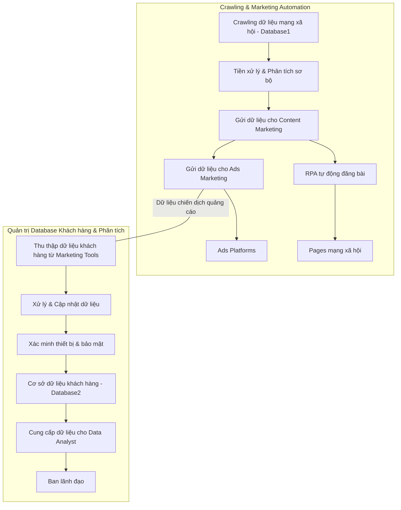

# Nghiệp vụ Data Engineering quản trị database trong Marketing
## Tổng quan
Data Engineering chịu trách nhiệm xây dựng và vận hành hệ thống thu thập, xử lý, lưu trữ và quản trị dữ liệu phục vụ cho các bộ phận Content Marketing, Ads Marketing và Data Analyst. Hai luồng công việc chính bao gồm:

- Crawling dữ liệu mạng xã hội và tự động hoá quy trình tạo nội dung, đăng bài và chạy quảng cáo.
- Thiết lập hạ tầng quản trị dữ liệu khách hàng từ các nguồn marketing, đảm bảo dữ liệu sạch, an toàn và sẵn sàng cho phân tích.

---

## 1. Luồng 1: Crawling dữ liệu mạng xã hội và tự động hoá marketing

### Mục tiêu
- Thu thập dữ liệu từ mạng xã hội (Facebook, Instagram, Twitter, TikTok, v.v.) phục vụ cho Content Marketing.
- Tự động gửi dữ liệu thô và kết quả phân tích sơ bộ cho Content Marketing để tạo bài viết.
- Tích hợp công cụ RPA (Robotic Process Automation) để tự động đăng bài lên nhiều pages.
- Chuyển dữ liệu bài viết và chiến dịch sang Ads Marketing để chạy quảng cáo.

### Quy trình chi tiết

1. **Crawling dữ liệu mạng xã hội**
   - Xây dựng hoặc sử dụng API, công cụ scraping để thu thập dữ liệu:
     - Nội dung bài viết, comment, lượt tương tác, hashtag, xu hướng,...
     - Tần suất thu thập theo lịch định sẵn (ví dụ 1 tiếng/lần, hoặc theo thời gian thực).
   - Định dạng và lưu dữ liệu thô (raw data) vào hệ thống lưu trữ (Data Lake/Data Warehouse).

2. **Tiền xử lý và phân tích sơ bộ**
   - Làm sạch dữ liệu (lọc spam, duplicate).
   - Phân tích sơ bộ: xác định chủ đề hot, xu hướng, hashtag thịnh hành.
   - Tổng hợp các insights phục vụ Content Marketing.

3. **Gửi dữ liệu cho Content Marketing**
   - Cung cấp giao diện hoặc API để Content Marketing truy cập dữ liệu và insights.
   - Tự động gửi email hoặc thông báo có dữ liệu mới, đề xuất nội dung dựa trên phân tích.

4. **RPA tự động đăng bài**
   - Kết nối với công cụ RPA để tự động đăng bài viết lên nhiều pages mạng xã hội theo lịch trình.
   - Giám sát trạng thái đăng bài, log lỗi và báo cáo kết quả đăng bài tự động.
   - Quản lý lại các bài viết đã đăng và thống kê hiệu quả tương tác.

5. **Gửi dữ liệu cho Ads Marketing**
   - Chuyển bài viết đã đăng hoặc bài viết được chọn sang Ads Marketing.
   - Hỗ trợ định dạng dữ liệu phù hợp với hệ thống chạy quảng cáo (Facebook Ads Manager, Google Ads,...).
   - Cung cấp API hoặc bảng tổng hợp để Ads Marketing triển khai chạy quảng cáo nhanh chóng.

### Luồng Crawling dữ liệu mạng xã hội & tự động hoá marketing
#### Yêu cầu chính
- Lưu trữ dữ liệu phi cấu trúc / bán cấu trúc (JSON, text).
- Hỗ trợ truy vấn linh hoạt, tích hợp dễ với Python để xử lý.
- Triển khai on-premise, dễ mở rộng.

#### Công cụ gợi ý

| Công cụ     | Lý do phù hợp                                                                                         |
|-------------|-----------------------------------------------------------------------------------------------------|
| **MongoDB** | - Lưu trữ dữ liệu dạng JSON, phi cấu trúc phù hợp dữ liệu mạng xã hội.                              |
|             | - Hỗ trợ truy vấn bằng query language đơn giản, Python có driver tốt (PyMongo).                     |
|             | - Triển khai on-prem, dễ dàng mở rộng theo cụm.                                                     |
| **Elasticsearch** | - Tối ưu cho dữ liệu text, tìm kiếm nhanh, phân tích real-time.                               |
|             | - Hỗ trợ REST API, Python có thư viện elasticsearch-py.                                            |
|             | - Dùng on-prem để lưu trữ log, dữ liệu mạng xã hội và hỗ trợ báo cáo nhanh.                         |

---

## 2. Luồng 2: Thiết lập hạ tầng quản trị database khách hàng cho marketing & phân tích

### Mục tiêu
- Quản lý tập trung dữ liệu khách hàng thu thập từ các công cụ marketing (website, landing page, ads,...).
- Đảm bảo dữ liệu được lưu trữ an toàn, mã hóa, cập nhật liên tục và xác minh tính hợp lệ (thiết bị, cookie,...).
- Cung cấp dữ liệu chuẩn, sạch cho Data Analyst phân tích và báo cáo cho ban lãnh đạo.

### Quy trình chi tiết

1. **Thu thập dữ liệu khách hàng từ các công cụ marketing**
   - Kết nối API hoặc hệ thống ETL (Extract-Transform-Load) để lấy dữ liệu từ:
     - Các công cụ chạy quảng cáo (Facebook Ads, Google Ads, Email Marketing,...).
     - Website, landing page (qua tracking pixel, form đăng ký,...).
     - CRM hoặc hệ thống quản lý khách hàng hiện tại.
   - Tập trung dữ liệu vào một database hoặc hệ thống Data Warehouse.

2. **Xử lý dữ liệu và cập nhật**
   - Chuẩn hóa dữ liệu đầu vào (định dạng, chuẩn hóa tên, email, số điện thoại).
   - Xử lý trùng lặp, loại bỏ dữ liệu không hợp lệ.
   - Mã hóa thông tin nhạy cảm (PII) theo chính sách bảo mật và GDPR, CCPA (nếu có).
   - Lưu lịch sử cập nhật và version dữ liệu.

3. **Xác minh thiết bị và thông tin khách hàng**
   - Kiểm tra tính hợp lệ thiết bị (thiết bị truy cập, IP, cookie).
   - Áp dụng các biện pháp xác thực hoặc đánh dấu thiết bị đáng tin cậy.
   - Tích hợp hệ thống phát hiện fraud hoặc bất thường (nếu có).

4. **Quản trị và bảo mật hệ thống dữ liệu**
   - Thiết lập quyền truy cập dữ liệu phân tầng theo nhóm người dùng.
   - Sao lưu định kỳ và phục hồi dữ liệu.
   - Giám sát logs truy cập và thay đổi dữ liệu.

5. **Cung cấp dữ liệu cho Data Analyst**
   - Thiết kế schema dữ liệu chuẩn, dễ dùng cho phân tích.
   - Xây dựng API hoặc công cụ truy vấn dữ liệu trực tiếp.
   - Đảm bảo dữ liệu cập nhật liên tục, có khả năng truy xuất nhanh.
   - Hỗ trợ Data Analyst trong việc xây dựng báo cáo, dashboard cho ban lãnh đạo.

### Luồng Quản trị database khách hàng & phân tích

#### Yêu cầu chính
- Quản lý dữ liệu quan hệ, nhiều bảng, chuẩn hóa dữ liệu.
- Bảo mật, mã hóa, phân quyền.
- Hỗ trợ tốt SQL, có thể tích hợp DAX cho BI (Power BI).
- Triển khai on-prem, ổn định cho doanh nghiệp.

#### Công cụ gợi ý

| Công cụ                | Lý do phù hợp                                                                                   |
|------------------------|-----------------------------------------------------------------------------------------------|
| **Microsoft SQL Server** | - Hỗ trợ đầy đủ SQL, tối ưu cho dữ liệu quan hệ.                                             |
|                        | - Tích hợp sâu với Power BI, dùng DAX cho phân tích nâng cao.                                 |
|                        | - Tính năng bảo mật, phân quyền, mã hóa dữ liệu chuẩn doanh nghiệp.                           |
|                        | - Triển khai on-prem mạnh mẽ, có hệ sinh thái công cụ quản trị và backup tốt.                 |
| **PostgreSQL**         | - Hỗ trợ chuẩn SQL mạnh mẽ, mở rộng JSON cho dữ liệu bán cấu trúc nếu cần.                    |
|                        | - Python có thư viện hỗ trợ rất tốt (psycopg2, SQLAlchemy).                                   |
|                        | - Cộng đồng lớn, triển khai on-prem ổn định, dễ dàng mở rộng.                                 |
|                        | - Có thể tích hợp BI bằng Power BI qua kết nối trực tiếp hoặc các công cụ trung gian.         |

---
