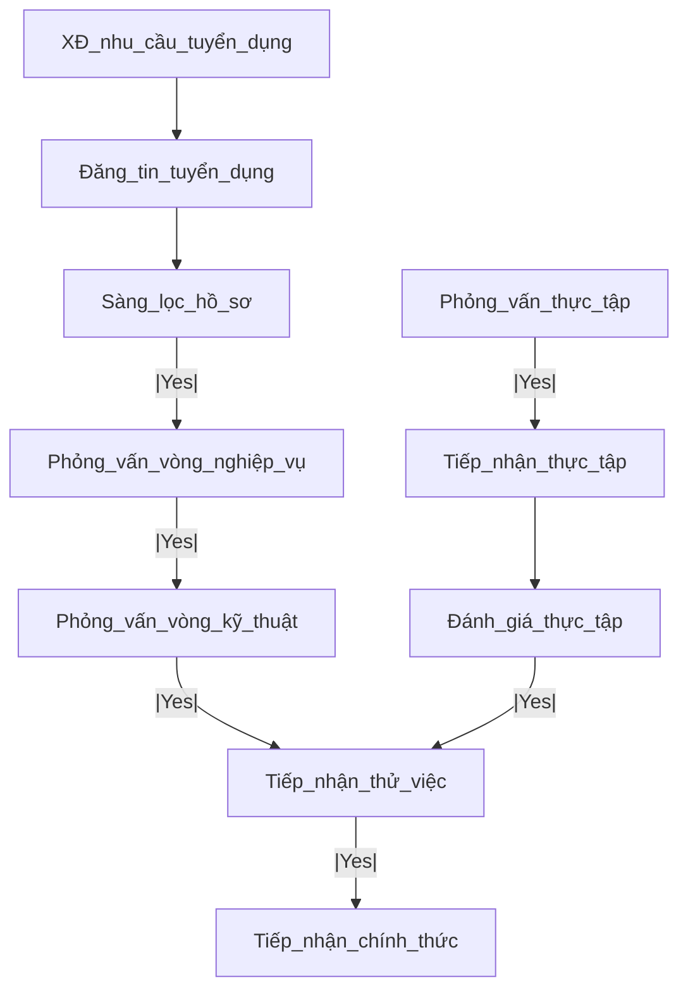

## 1.Quy trình tuyển dụng tại phòng DA - Trung tâm SX

### Bước 1: Xác định nhu cầu tuyển dụng:
* Xây dựng JD (Job Description) chi tiết cho từng vị trí, bao gồm cả danh sách các kiến thức, kỹ năng và bằng cấp, chứng chỉ.
* BGĐ phê duyệt kế hoạch tuyển dụng.

### Bước 2: Đăng tin trên các kênh tuyển dụng:

### Bước 3: Sàng lọc hồ sơ:
* Vị trí nghiệp vụ: BA, PO, PM, Tester QA, DA, Data Scientist
* Vị trí kỹ thuật: Dev Backend, Dev Frontend, Dev Ops, DE, AI Engineering

### Bước 4: Phỏng vấn:
* 1.Phỏng vấn chuyên môn nghiệp vụ
* 2.Phỏng vấn kỹ thuật, kỹ năng

### Bước 5: Thử việc:
* Đào tạo hội nhập
* Training on job

---
# Job Description (JD) theo 10 vị trí tại phòng DA

Nhóm nghiệp vụ: PO, PM, BA, QA-QC-Tester, DA data analyst, DS data scientist
Nhóm kỹ thuật: Dev bacekend, Dev frontend, DevOps, DE data engineer, AE AI Engineer

## 1.Vị trí Dev Backend - Lập trình viên phát triển nền tảng (xây dựng logic hệ thống & API)
### Trách nhiệm chính:
- **Xây dựng API và microservices**: Thiết kế, triển khai và duy trì API hiệu suất cao.
- **Phát triển hệ thống backend**: Xây dựng các giải pháp backend mạnh mẽ và tối ưu.
- **Tích hợp với hệ thống khác**: Làm việc cùng các nhóm Frontend và AI để đảm bảo tích hợp hiệu quả.
- **Quản lý dữ liệu và bảo mật**: Đảm bảo hệ thống có tính bảo mật và hiệu suất cao.
- **Hỗ trợ phát triển AI**: Tham gia vào các dự án liên quan đến **chatbot, NLP, machine learning, deep learning, computer vision**.

### Yêu cầu:
- **Kinh nghiệm Python**: Ít nhất 1 năm kinh nghiệm lập trình với **Python** trong phát triển backend.
- **Kinh nghiệm API**: Thành thạo trong việc xây dựng API trên **RESTful API**, **GraphQL** và kiểm thử API trên **Postman**.
- **Microservices**: Có hiểu biết về microservices và các công cụ như **Docker**, **Kubernetes**.
- **Machine Learning/AI**: Có kinh nghiệm về **NLP**, **Chatbot**, **Computer vision**, **Machine learning**, **Deep learning** là lợi thế.
- **Cơ sở dữ liệu**: Kinh nghiệm làm việc với **ChromaDB**, **PostgreSQL**, **NoSQL** (Qdrant, MongoDB, Redis...).
- **Cloud Services**: Có hiểu biết về các cloud như **AWS**, **Google Cloud**, **Azure** hoặc triển khai On-premises.
- **Code Quality**: Nắm vững các best practices về clean code, reusable code, và unit testing.

### Lợi thế:
- Kinh nghiệm thực tế triển khai các giải pháp AI solutions như **đọc tài liệu** từ các định dạng .doc, .pdf, .xls..., **đọc hình ảnh** (image2text), hoặc **đọc âm thanh** (audio2text).
- Kinh nghiệm làm việc với **CI/CD**, **Jenkins**, **Travis CI**.
- Hiểu biết về **Agile**, **Scrum**, **DevOps**.

---
## 2. Vị trí Dev Frontend – Lập trình viên giao diện người dùng (xây dựng UI cho chatbot và hệ thống dashboard)
### 🎯 Trách nhiệm chính:
- **Xây dựng giao diện người dùng**: Thiết kế và phát triển giao diện web hiện đại, thân thiện với người dùng cho hệ thống chatbot, tìm kiếm tài liệu, và quản trị backend.
- **Tối ưu trải nghiệm người dùng (UX/UI)**: Cải thiện liên tục trải nghiệm người dùng trên đa nền tảng: Web, Mobile, Portal, MS Teams...
- **Tích hợp API và backend**: Kết nối hệ thống frontend với backend, xử lý dữ liệu từ API để hiển thị mượt mà, hiệu quả.
- **Responsive Design**: Đảm bảo giao diện hoạt động tốt trên nhiều thiết bị (desktop, tablet, mobile).
- **Phối hợp với team kỹ thuật**: Làm việc chặt chẽ với Backend, AI Engineer và Data để đảm bảo tính đồng bộ của hệ thống.
- **Tối ưu hiệu suất giao diện**: Kiểm soát tải trang, tối ưu asset, lazy loading...

### 🧠 Yêu cầu:
- **Kinh nghiệm frontend**: Tối thiểu 1 năm kinh nghiệm với các framework hiện đại như **ReactJS**, **VueJS** hoặc **NextJS**.
- **HTML/CSS/JS vững chắc**: Thành thạo trong việc viết mã HTML5, CSS3 (SCSS/Tailwind), JavaScript hiện đại (ES6+).
- **Kỹ năng State Management**: Có kinh nghiệm sử dụng **Redux**, **Pinia**, **Vuex** hoặc tương đương.
- **Giao tiếp với API**: Thành thạo gọi API (REST/GraphQL), xử lý dữ liệu trả về, quản lý lỗi, loading.
- **Công cụ build & dev**: Quen thuộc với **Vite**, **Webpack**, **Babel**, **NPM/Yarn**.
- **Version control**: Sử dụng thành thạo **Git**, GitFlow.

### 💡 Lợi thế:
- Kinh nghiệm xây dựng dashboard quản trị (thống kê, biểu đồ, quản lý tài liệu, phân quyền...).
- Kinh nghiệm với hệ thống chatbot (UI chat real-time, typing animation, Avatar, đa modal...).
- Biết sử dụng thư viện UI như **ShadCN**, **Material UI**, **Ant Design**, **TailwindCSS**.
- Hiểu biết về **SSR/CSR**, **PWA**, tối ưu SEO cho frontend.
- Có khả năng **mock API** và tự test giao diện không cần backend.
- Có kinh nghiệm làm việc trong môi trường **Scrum Agile**.

---
## 3. Vị trí AI Engineer – Kỹ sư Trí tuệ Nhân tạo

### 🎯 Trách nhiệm chính:
- **Phát triển hệ thống AI nội bộ**: Xây dựng các giải pháp liên quan đến **RAG, NLP, Chatbot, Vision AI** phục vụ tìm kiếm tài liệu, trả lời câu hỏi và phân tích dữ liệu.
- **Triển khai các mô hình AI**: Fine-tune, embedding, vector search (FAISS, Qdrant, ChromaDB...) và tích hợp LLM như GPT, Vistral, LLaMA, Claude...
- **Thiết kế pipeline AI**: Chuẩn bị dữ liệu, huấn luyện mô hình, đánh giá kết quả, triển khai inference.
- **Xử lý ngôn ngữ tự nhiên (NLP)**: Tách văn bản từ doc/pdf/xls/image/audio, phân tích câu hỏi, sinh câu trả lời chính xác và ngắn gọn.
- **Xây dựng hệ thống tìm kiếm thông minh (semantic search)**: Kết hợp từ khoá và embedding để tìm kiếm theo ngữ nghĩa đa ngôn ngữ.
- **Tích hợp AI vào hệ thống**: Làm việc với frontend/backend để tích hợp AI vào giao diện người dùng và API.

### 🧠 Yêu cầu:
- **Kinh nghiệm mô hình ngôn ngữ**: Thành thạo sử dụng các mô hình LLM open-source (Hugging Face, Ollama, OpenAI API...).
- **Xử lý dữ liệu đa định dạng**: Có kinh nghiệm với dữ liệu từ **doc, pdf, xls, image, audio**.
- **Vector Database**: Thành thạo với **ChromaDB**, **Qdrant**, **FAISS**, **Pinecone**, **Weaviate**.
- **Xử lý NLP đa ngôn ngữ**: Sử dụng tốt các thư viện như **spaCy**, **transformers**, **sentence-transformers**, **LangChain**.
- **Kỹ năng Embedding & Search**: Có khả năng thiết kế hệ thống semantic search và RAG.
- **Machine Learning cơ bản**: Biết xử lý, huấn luyện và đánh giá mô hình học máy cổ điển.
- **Kỹ năng code**: Thành thạo Python, biết tổ chức mã theo module, có thể viết các dịch vụ nhỏ để phục vụ inference.

### 💡 Lợi thế:
- Kinh nghiệm triển khai **AI Agent** xử lý nghiệp vụ nội bộ (QA, đọc hiểu, sinh SQL, sinh báo cáo...).
- Đã từng làm với mô hình đa modal (image captioning, audio transcription).
- Có khả năng sử dụng **Whisper**, **Tesseract**, **CLIP**, **BLIP**, hoặc các mô hình đọc ảnh/video.
- Kinh nghiệm tích hợp AI vào ứng dụng web/app (via API, WebSocket hoặc SDK).
- Biết về **ETL**, **data pipeline**, **Hugging Face Hub**, **Prompt Engineering**.
- Có khả năng tối ưu hóa chi phí và tốc độ inference (sử dụng GGUF, quantization...).
- Làm việc tốt với team Dev, hiểu về DevOps, có thể tự deploy model nếu cần.

---
## 4. Vị trí Data Engineer – Kỹ sư dữ liệu

### 🎯 Trách nhiệm chính:
- **Xây dựng pipeline xử lý dữ liệu**: Thiết kế và triển khai pipeline để ingest, clean, transform và chuẩn hóa dữ liệu từ nhiều nguồn khác nhau (tài liệu, API, database…).
- **Xử lý dữ liệu phi cấu trúc**: Trích xuất dữ liệu từ **PDF, DOC, XLS, hình ảnh (OCR), audio (transcript)** để phục vụ huấn luyện AI.
- **Thiết kế schema lưu trữ dữ liệu**: Phân tích cấu trúc dữ liệu để lưu trữ hiệu quả trong **ChromaDB, Qdrant, PostgreSQL, MongoDB**...
- **Quản lý chất lượng dữ liệu**: Đảm bảo dữ liệu sạch, đầy đủ, không trùng lặp, có thể tìm kiếm và truy vấn nhanh.
- **Tích hợp với hệ thống lưu trữ nội bộ**: Đồng bộ dữ liệu từ hệ thống ERP, Core Banking, CRM... lên nền tảng phục vụ AI và Chatbot.
- **Phối hợp cùng AI Engineer**: Chuẩn bị dữ liệu huấn luyện và dữ liệu phục vụ truy vấn (RAG, semantic search...).

### 🧠 Yêu cầu:
- **Kinh nghiệm xử lý dữ liệu**: Ít nhất 1 năm làm việc với **dữ liệu văn bản, số, phi cấu trúc**.
- **Kỹ năng ETL/ELT**: Có kinh nghiệm với các công cụ như **Airflow, Luigi**, hoặc tự xây dựng pipeline bằng **Python**.
- **Cơ sở dữ liệu**: Thành thạo **PostgreSQL**, **MongoDB**, **Redis**, hiểu NoSQL/Relational.
- **Vector DB**: Biết cách index và quản lý dữ liệu trong **ChromaDB**, **Qdrant**, hoặc **FAISS**.
- **Xử lý dữ liệu văn bản**: Biết làm việc với **PyMuPDF**, **PDFMiner**, **Pandas**, **Tika**, **docx**, **openpyxl**...
- **Kỹ năng tối ưu**: Hiểu rõ performance, indexing, caching, và các nguyên tắc để đảm bảo tốc độ truy vấn nhanh.

### 💡 Lợi thế:
- Kinh nghiệm thu thập dữ liệu từ web, API nội bộ hoặc ERP (crawling, crawling-intranet, SOAP/REST).
- Có khả năng xây dựng hệ thống chuẩn hóa và phân loại dữ liệu tự động.
- Đã làm việc trong môi trường kết nối với **Data Warehouse**, **Realtime Event Streaming** (Kafka, RabbitMQ...).
- Biết triển khai **job đồng bộ dữ liệu định kỳ** (cronjob, event-driven).
- Hiểu mô hình **star schema, snowflake schema**, phục vụ phân tích báo cáo và AI.
- Kinh nghiệm làm việc trong team Agile, phối hợp chặt chẽ với AI/Backend.

---
## 5. Vị trí PM/PO – Quản lý sản phẩm & dự án (dẫn dắt đội ngũ xây dựng giải pháp AI và chatbot nội bộ)

### 🎯 Trách nhiệm chính:
- **Quản lý sản phẩm (PO)**:
  - Xây dựng **tầm nhìn sản phẩm**, chiến lược phát triển qua từng version (MVP → scale).
  - Viết và quản lý **Product Backlog**: Epic, User Story, Acceptance Criteria rõ ràng.
  - **Ưu tiên tính năng** dựa trên giá trị kinh doanh, tính khả thi và thời gian triển khai.
  - Đồng hành với team AI/Dev/UX để phát triển sản phẩm sát với nhu cầu thực tế.

- **Quản lý dự án (PM)**:
  - Lập **kế hoạch triển khai theo Sprint**, theo dõi tiến độ hàng tuần.
  - Tổ chức **daily meeting**, **sprint review**, **retrospective**.
  - Điều phối công việc giữa các thành viên: AI Engineer, Backend, Frontend, Data...
  - Đảm bảo sản phẩm đáp ứng mục tiêu về **chất lượng, deadline, tài nguyên**.

- **Làm việc với stakeholders**:
  - Thu thập yêu cầu từ các phòng ban nghiệp vụ, khách hàng nội bộ.
  - Demo sản phẩm, đào tạo và tiếp nhận phản hồi từ người dùng.

### 🧠 Yêu cầu:
- **Kinh nghiệm PM/PO**: Tối thiểu 2 năm kinh nghiệm quản lý dự án hoặc sản phẩm công nghệ.
- **Kiến thức Agile/Scrum**: Hiểu sâu mô hình Scrum, biết cách viết user story, tổ chức sprint hiệu quả.
- **Hiểu về sản phẩm AI/chatbot**: Biết các khái niệm cơ bản về NLP, vector search, API, UI/UX...
- **Kỹ năng giao tiếp & điều phối**: Có khả năng kết nối nhiều nhóm kỹ thuật khác nhau và truyền đạt rõ ràng mục tiêu.
- **Tư duy hệ thống**: Biết cách thiết kế luồng nghiệp vụ, sơ đồ chức năng, mapping dữ liệu giữa các hệ thống.

### 💡 Lợi thế:
- Kinh nghiệm triển khai **sản phẩm AI/NLP nội bộ** cho doanh nghiệp hoặc ngân hàng.
- Biết sử dụng **Notion**, **Jira**, **Miro**, **Figma** để quản lý tài liệu và quy trình.
- Có nền tảng về **UX**, **design thinking**, hoặc kỹ thuật mô hình hóa (BPMN, Flowchart...).
- Đã từng quản lý sản phẩm liên quan đến **tích hợp ERP, Portal, Core Banking, CRM, RPA**.
- Có chứng chỉ liên quan: **PSPO I/II**, **PMP**, **Scrum Master**, **Agile Coach** là điểm cộng.

---
## 6. Vị trí Tester / QA / QC – Kiểm thử phần mềm

### 🎯 Trách nhiệm chính:
- **Phân tích yêu cầu & xây dựng test case**:
  - Đọc hiểu User Story, mô tả nghiệp vụ, luồng tương tác chatbot.
  - Thiết kế **Test Case, Test Scenario, Test Plan** phù hợp cho từng module: chatbot, API, giao diện, xử lý AI.

- **Thực hiện kiểm thử thủ công và tự động**:
  - Kiểm thử giao diện Web/Mobile (UI/UX), chatbot interface (text/audio/image).
  - Kiểm thử API (RESTful, GraphQL) với công cụ như **Postman**, **Swagger**, **Insomnia**.
  - Viết test script cơ bản (nếu có thể) bằng **Selenium**, **Playwright**, **Cypress** hoặc **Postman Test Script**.

- **Quản lý lỗi & phối hợp với Dev**:
  - Ghi nhận bug chi tiết, đề xuất cải tiến UI/UX, logic xử lý hoặc phản hồi AI.
  - Phối hợp chặt chẽ với Frontend, Backend, AI Engineer để fix và re-test.

- **Đảm bảo chất lượng toàn hệ thống**:
  - Kiểm thử tích hợp nhiều module (AI – API – UI), kiểm thử hồi quy và kiểm thử hiệu năng.
  - Theo dõi logs, response time, kiểm tra bảo mật cơ bản (authen, quyền truy cập).

### 🧠 Yêu cầu:
- **Kinh nghiệm QA**: Tối thiểu 1 năm kinh nghiệm kiểm thử phần mềm (manual hoặc automation).
- **Kiến thức API**: Thành thạo test API qua **Postman**, hiểu rõ status code, request/response, auth token.
- **Kiến thức nghiệp vụ**: Có khả năng phân tích quy trình nghiệp vụ cơ bản để kiểm thử chính xác.
- **Công cụ quản lý**: Biết sử dụng **Jira**, **TestRail**, **Notion** hoặc Google Sheet để viết test case.
- **Tư duy phản biện và chi tiết**: Khả năng phát hiện lỗi logic/phản hồi AI sai/hiển thị giao diện chưa hợp lý.

### 💡 Lợi thế:
- Kinh nghiệm kiểm thử các hệ thống **AI chatbot**, **OCR**, **search engine**, **audio transcription**.
- Đã từng kiểm thử hệ thống quản lý tài liệu hoặc báo cáo nội bộ.
- Biết viết **script automation** (Selenium, Cypress, Playwright…) là một lợi thế lớn.
- Biết sử dụng **Figma**, **DevTools**, **Browser Console** để phân tích UI.
- Có thể kiểm thử đa thiết bị, đa trình duyệt (cross-platform, responsive).
- Có hiểu biết về kiểm thử bảo mật (SQLi, XSS, auth check...) là điểm cộng.

---
## 7. Vị trí Data Scientist – Nhà khoa học dữ liệu

### 🎯 Trách nhiệm chính:
- **Phân tích dữ liệu chuyên sâu**:
  - Khai phá, xử lý và phân tích tập dữ liệu lớn từ nhiều nguồn: database, hệ thống API, file tài liệu, ảnh, audio...
  - Trích xuất insight từ dữ liệu để phục vụ xây dựng sản phẩm AI/Chatbot hoặc hỗ trợ ra quyết định cho doanh nghiệp.

- **Xây dựng mô hình học máy và thống kê**:
  - Triển khai các mô hình **Machine Learning / Deep Learning** (classification, regression, clustering...).
  - Tối ưu mô hình: feature selection, hyperparameter tuning, cross-validation.
  - Đánh giá mô hình với các chỉ số như R², F1, ROC-AUC, confusion matrix...

- **Ứng dụng NLP và AI đa lĩnh vực**:
  - Tham gia xử lý bài toán thực tế như **tóm tắt văn bản**, **phân loại tài liệu**, **nhận diện thực thể**, **dò tìm gian lận**, **dự báo tài chính**...
  - Hợp tác với AI Engineer để tích hợp mô hình vào hệ thống hoặc API.

- **Trực quan hóa và storytelling**:
  - Xây dựng báo cáo trực quan (Dashboards, Report automation) bằng **Power BI**, **Tableau**, hoặc Python (**Plotly**, **Matplotlib**, **Seaborn**...).
  - Trình bày insight rõ ràng, hỗ trợ các bên nghiệp vụ hiểu và hành động theo dữ liệu.

### 🧠 Yêu cầu:
- **Kinh nghiệm mô hình hóa dữ liệu**: Tối thiểu 1–2 năm kinh nghiệm làm việc với các mô hình ML/AI thực tế.
- **Ngôn ngữ lập trình**: Thành thạo Python (pandas, sklearn, numpy, matplotlib...).
- **Xử lý dữ liệu**: Biết xây dựng pipeline xử lý và phân tích dữ liệu lớn.
- **Machine Learning**: Thành thạo supervised và unsupervised learning, biết một số deep learning framework (PyTorch/TensorFlow).
- **Cơ sở dữ liệu**: Thành thạo truy vấn SQL (PostgreSQL/MySQL), biết cách làm việc với NoSQL là lợi thế.
- **Kỹ năng trình bày và báo cáo**: Biết cách phân tích vấn đề từ dữ liệu, storytelling, báo cáo business insight.

### 💡 Lợi thế:
- Kinh nghiệm làm việc với **chatbot**, **semantic search**, **recommender systems**, hoặc **risk scoring**.
- Từng triển khai mô hình phục vụ **production**, biết các quy trình như **MLOps**, **model versioning**, **inference API**.
- Biết làm việc với **Spark**, **Databricks**, hoặc các nền tảng dữ liệu lớn.
- Có tư duy sản phẩm và kinh nghiệm làm việc cùng PO/PM để xây dựng giải pháp theo yêu cầu cụ thể.
- Có nền tảng toán thống kê vững (hypothesis testing, Bayesian inference...).
- Biết sử dụng **LangChain**, **OpenAI API**, hoặc tích hợp với LLM là điểm cộng lớn.

---
## 8. Vị trí Business Analyst – Chuyên viên phân tích nghiệp vụ

### 🎯 Trách nhiệm chính:
- **Thu thập và phân tích yêu cầu nghiệp vụ**:
  - Làm việc với các phòng ban, người dùng cuối để xác định nhu cầu, vấn đề và mục tiêu kinh doanh.
  - Ghi nhận yêu cầu, mô hình hóa quy trình bằng **BPMN**, **flowchart**, **use case**...

- **Phân tích hệ thống & đề xuất giải pháp**:
  - Phân tích khả năng khả thi về mặt công nghệ: chatbot, tìm kiếm thông minh, tích hợp API, AI xử lý tài liệu...
  - Làm việc với PM/PO để đề xuất tính năng theo từng phase của sản phẩm (MVP, scale...).

- **Viết tài liệu & hỗ trợ phát triển**:
  - Viết tài liệu đặc tả **BRD**, **FRD**, **User Story**, **Acceptance Criteria**.
  - Làm cầu nối giữa team **Dev - AI - Tester** và các bên nghiệp vụ.
  - Xác nhận kết quả triển khai theo yêu cầu thực tế của người dùng (UAT).

- **Đào tạo & hỗ trợ triển khai**:
  - Hướng dẫn người dùng cuối, viết tài liệu hướng dẫn sử dụng (user manual).
  - Thu thập phản hồi sau khi triển khai để liên tục cải tiến sản phẩm.

### 🧠 Yêu cầu:
- **Kinh nghiệm BA**: Tối thiểu 1–2 năm ở vị trí BA trong dự án phần mềm nội bộ hoặc doanh nghiệp.
- **Hiểu biết hệ thống**: Biết cách phân tích nghiệp vụ có liên quan đến **chatbot**, **search engine**, **quản lý tài liệu**, hoặc **AI nội bộ**.
- **Tài liệu hóa tốt**: Thành thạo viết **User Story**, **Mô tả nghiệp vụ**, **Sơ đồ luồng**, **Wireframe**.
- **Kỹ năng giao tiếp & phối hợp**: Làm việc hiệu quả với team kỹ thuật và phi kỹ thuật, truyền đạt ý tưởng rõ ràng.
- **Kỹ năng phân tích**: Có khả năng đặt câu hỏi, phát hiện điểm nghẽn và đề xuất cải tiến hệ thống.

### 💡 Lợi thế:
- Kinh nghiệm làm việc trong các dự án AI, NLP, chatbot hoặc RPA.
- Biết sử dụng công cụ phân tích như: **Draw.io**, **Miro**, **Figma**, **Notion**, **Jira**.
- Hiểu về API, mô hình dữ liệu, SQL ở mức cơ bản để giao tiếp với kỹ thuật.
- Có tư duy sản phẩm và mindset Agile/Scrum.
- Từng làm việc với các hệ thống lớn như ERP, CRM, CoreBanking là điểm cộng.

---
## 9. Vị trí DevOps Engineer – Kỹ sư triển khai & vận hành hệ thống

### 🎯 Trách nhiệm chính:
- **Quản lý hạ tầng hệ thống**:
  - Triển khai, cấu hình và giám sát hệ thống trên **Cloud (AWS, GCP, Azure)** hoặc **On-premises**.
  - Thiết lập các môi trường **Dev, Staging, Production** ổn định và an toàn.

- **Thiết lập CI/CD pipelines**:
  - Sử dụng các công cụ như **GitHub Actions, GitLab CI, Jenkins, TravisCI** để tự động hóa quy trình build, test, deploy.
  - Triển khai mô hình inference, AI service một cách ổn định và có thể scale.

- **Giám sát và cảnh báo**:
  - Thiết lập hệ thống giám sát hiệu năng với **Prometheus, Grafana, ELK Stack, Sentry**...
  - Thiết lập cảnh báo theo thời gian thực khi có lỗi, downtime, hoặc hành vi bất thường.

- **Bảo mật và sao lưu**:
  - Quản lý phân quyền truy cập hệ thống, thiết lập firewall, giới hạn API token/key.
  - Thiết lập chính sách backup dữ liệu và recovery.

- **Phối hợp triển khai AI & Chatbot**:
  - Làm việc chặt chẽ với AI Engineer và Backend để đảm bảo quá trình deploy model, scaling, hot reload các vector store, database.

### 🧠 Yêu cầu:
- 1–2 năm kinh nghiệm ở vị trí DevOps hoặc Site Reliability Engineer.
- Thành thạo **Docker**, **Kubernetes**, **Ansible**, hoặc **Terraform**.
- Có kinh nghiệm với hệ thống **CI/CD**, quản lý version, rollback, blue-green deployment.
- Hiểu kiến trúc microservices, RESTful API, và các vấn đề về hiệu suất mạng.
- Có khả năng xử lý log, monitor, và quản lý incidents hiệu quả.
- Biết tối ưu hoá chi phí Cloud là một điểm cộng.

### 💡 Lợi thế:
- Từng triển khai hệ thống inference mô hình AI (LLM, vision, audio...).
- Có kinh nghiệm deploy chatbot hoặc vector search engine.
- Biết cách cấu hình hệ thống caching (Redis), load balancing, autoscaling.
- Biết sử dụng công cụ như **Helm**, **Istio**, hoặc hệ thống phân phối model như **Ray**, **Triton Inference Server**.
- Có chứng chỉ DevOps (AWS, Azure, GCP...) là điểm cộng.

---
## 10. Vị trí IT Security Specialist – Chuyên gia bảo mật và an ninh hệ thống

### 🎯 Trách nhiệm chính:
- **Đảm bảo an toàn hệ thống hạ tầng**:
  - Phân tích, đánh giá và thiết kế giải pháp bảo mật cho toàn bộ hệ thống AI, Chatbot, API, Backend, Database và giao diện người dùng.
  - Phối hợp với DevOps/Backend để cấu hình hệ thống theo chuẩn bảo mật.

- **Phát hiện và ứng phó sự cố**:
  - Giám sát log truy cập, hành vi bất thường, cảnh báo sớm các cuộc tấn công như brute-force, injection, probing...
  - Thực hiện điều tra, xử lý và khắc phục sự cố bảo mật.

- **Đánh giá lỗ hổng hệ thống**:
  - Kiểm tra định kỳ (Pentest, Vulnerability Scan) với các công cụ như **Nessus**, **OpenVAS**, **BurpSuite**, **OWASP ZAP**.
  - Đưa ra khuyến nghị và phối hợp xử lý lỗ hổng với đội ngũ phát triển.

- **Xây dựng chính sách bảo mật**:
  - Thiết lập quy trình quản lý account, phân quyền, xác thực đa lớp (MFA, SSO...).
  - Soạn thảo tài liệu, quy trình bảo mật phù hợp với tiêu chuẩn ISO 27001, OWASP, NIST.

- **Huấn luyện nhận thức bảo mật nội bộ**:
  - Tổ chức đào tạo nội bộ định kỳ về an toàn thông tin, bảo mật email, mã độc, phishing...

### 🧠 Yêu cầu:
- Tốt nghiệp chuyên ngành CNTT, An toàn thông tin hoặc tương đương.
- 1–3 năm kinh nghiệm trong lĩnh vực bảo mật hệ thống hoặc kiểm thử xâm nhập.
- Thành thạo bảo mật mạng, bảo mật ứng dụng web, cấu hình firewall, proxy, VPN, IDS/IPS.
- Biết đánh giá rủi ro và theo dõi các chỉ số an toàn hệ thống.
- Có kiến thức cơ bản về mã hóa, chứng thực, bảo mật API và lưu trữ đám mây.

### 💡 Lợi thế:
- Kinh nghiệm bảo vệ hệ thống AI, NLP, vector search hoặc API phân tán.
- Biết audit hệ thống Linux, Web Server (Nginx, Apache), Database (PostgreSQL, MongoDB...).
- Có chứng chỉ bảo mật như **CEH**, **CompTIA Security+**, **OSCP**, **CISSP** là lợi thế lớn.
- Có kinh nghiệm xử lý sự cố thực tế (incident response), phân tích forensics hoặc SIEM.
- Nắm vững mô hình Zero Trust và các phương pháp hardening hệ thống.

---
